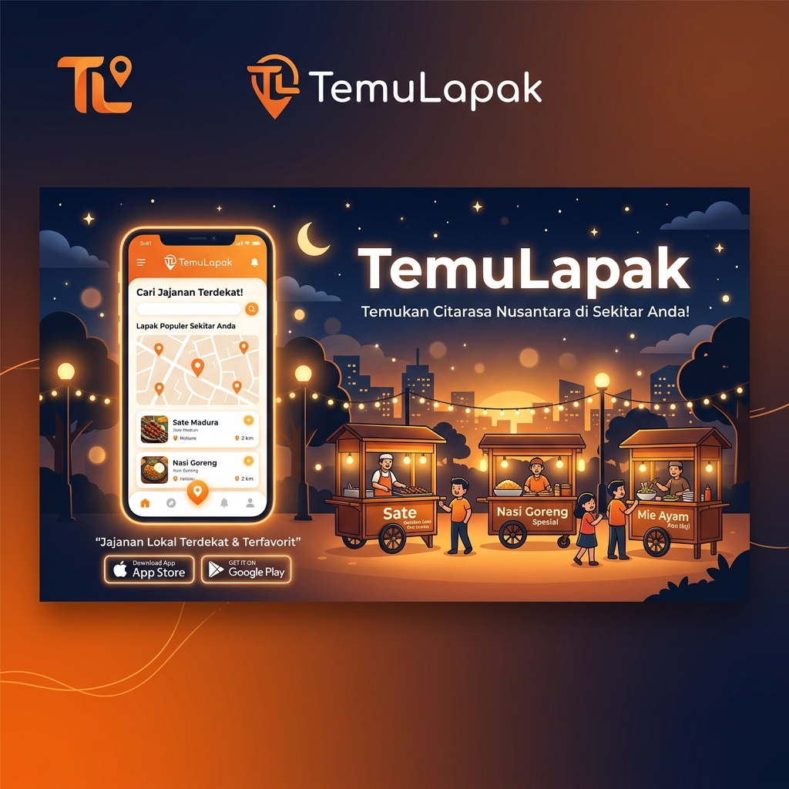

<p align="center">
  
</p>

<h1 align="center">TemuLapak</h1>

<p align="center">
  <strong>Temukan Citarasa Nusantara di Sekitar Anda!</strong><br>
  A premium Flutter mobile application designed to connect users with local street food vendors and merchants in real-time.
</p>

<p align="center">
  <a href="https://flutter.dev"></a>
  <a href="https://firebase.google.com"></a>
  <a href="https://pub.dev/packages/flutter_riverpod"></a>
  <br>
  
  
</p>

---

## 🚀 Key Features

| Feature | Description | Tech Stack |
| :--- | :--- | :--- |
| **📍 Live Vendor Discovery** | Pinpoint and track nearby street vendors on an interactive map. | `google_maps_flutter`, `geoflutterfire_plus` |
| **💬 Real-Time Chat** | Seamless, instant communication between buyers and merchants. | `cloud_firestore`, `flutter_chat_ui` |
| **🔔 Push Notifications** | Background activity tracking and instant chat updates. | `firebase_messaging`, `flutter_local_notifications` |
| **⚡ Offline Cache** | Instantly load previous sessions and user metadata offline. | `hive`, `hive_flutter` |
| **🔒 Secure Authentication** | Fast, secure social sign-ins and identity management. | `firebase_auth`, `google_sign_in` |
| **🎨 Premium Aesthetics** | Fluid micro-animations, customizable dark elements, and Outfit typography. | `lottie`, `shimmer`, `google_fonts` |

---

## 🛠️ Tech Stack & Architecture

This project adopts a scalable, domain-driven **MVVM (Model-View-ViewModel)** architecture:

*   **Frontend Core:** Flutter / Dart
*   **State Management:** Riverpod 2.x with code generation (`riverpod_generator`)
*   **Local Caching:** Hive database for fast metadata reads
*   **Backend Services:** Firebase Suite (Authentication, Firestore, Realtime Database, Cloud Storage)
*   **APIs Integrated:** Google Maps Platform (Maps SDK, Geocoding API)

### 📂 Directory Structure
```text
lib/
├── assets/                  # Icons, custom fonts, animations, and static images
├── config/                  # App environment specifications (.env loaders)
├── data/                    # Infrastructure layer handling data retrieval
│   ├── local/               # Local DB (Hive instances and adapters)
│   └── network/             # API services, Firebase integration, and push messaging
├── model/                   # Pure business/domain data models
├── utils/                   # Shared utility classes, formatters, and logger configurations
└── view/                    # UI presentation layer (Screens, Widgets, ViewModels)
    ├── chat_page/           # Chat list & conversation details
    ├── favorite_page/       # User bookmark/favorite lists
    ├── home_page/           # Map searches and discover feeds
    ├── login_page/          # Onboarding flows
    ├── merchant_dashboard/  # Merchant activity controllers
    └── profile_page/        # User accounts & settings
```

---

## ⚙️ Local Setup

Follow these simple steps to run the project locally on your machine:

### 1. Prerequisite Installation
Ensure you have the Flutter SDK (version `3.6.1` or higher) configured.

```bash
flutter pub get
```

### 2. Environment Configuration
Duplicate the provided `.env.example` file:
```bash
cp .env.example .env
```
Open `.env` and insert your own Firebase configuration values and Google Maps API key.

### 3. Add Platform Config Files
*   **Android:**
    ```bash
    cp android/app/google-services.json.example android/app/google-services.json
    ```
    *Replace example fields with your real Firebase Android configuration.*
*   **iOS:**
    ```bash
    cp ios/Runner/GoogleService-Info.plist.example ios/Runner/GoogleService-Info.plist
    ```
    *Replace example fields with your real Firebase iOS configuration.*

### 4. Inject Google Maps API Key
Add your Maps API key in `android/local.properties`:
```properties
maps.api.key=your-google-maps-api-key
```

### 5. Launch the Application
Run the project on a connected device/emulator:
```bash
flutter run
```

---

## 🔒 Security & Public Repo Policy

*   **No Exposed Credentials:** Active `.env`, `google-services.json`, `GoogleService-Info.plist`, and `local.properties` are explicitly added to `.gitignore`.
*   **Realtime Database:** Security rules inside `database.rules.json` require authenticated user scopes:
    ```json
    {
      "rules": {
        ".read": "auth != null",
        ".write": "auth != null"
      }
    }
    ```
*   **Storage Bucket:** Rules are locked down to secure path access matching user sessions.

---

## 👥 Meet the Team

*   **Shavarell Axel Ganendra** – Lead Mobile Developer & Founder ([axelg.bsns@gmail.com](mailto:axelg.bsns@gmail.com))
*   **Bagas Dwi Putra Majid** – Mobile Developer ([bagasdwiputramajid2003@gmail.com](mailto:bagasdwiputramajid2003@gmail.com))
*   **Gisela Audrey Limansagita** – Mobile Developer ([gslaudrey@gmail.com](mailto:gslaudrey@gmail.com))

---

<p align="center">
  Made with 🧡 by TemuLapak Team
</p>
